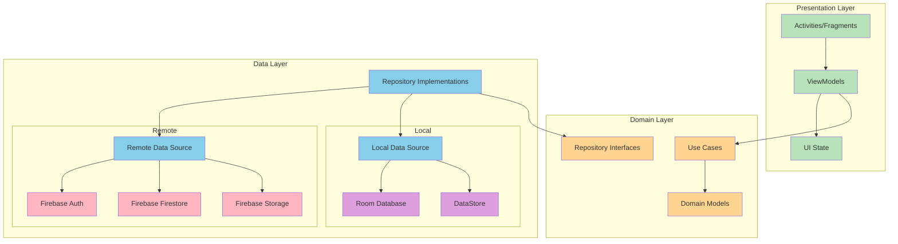
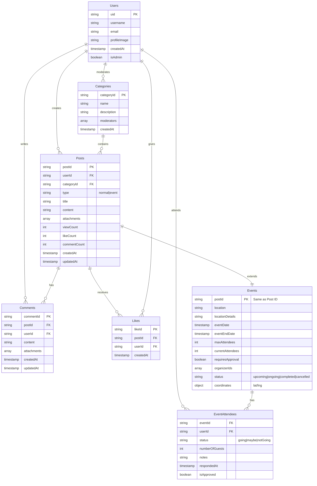
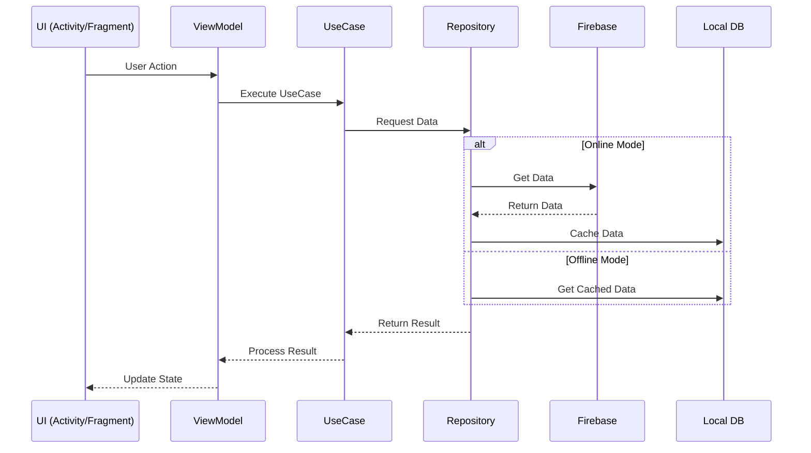

# EnSeñasApp 🤟

EnSeñasApp es una aplicación móvil diseñada para servir como puente de comunicación entre personas sordas y oyentes en Colombia, facilitando tanto el aprendizaje de la Lengua de Señas Colombiana (LSC) como la integración social de la comunidad sorda.

## 🎯 Objetivo

Abordar la brecha de comunicación que enfrentan las aproximadamente 500,000 personas sordas y 5 millones de personas con algún grado de discapacidad auditiva en Colombia, proporcionando herramientas tanto para el aprendizaje de LSC como para la interacción cotidiana.

## 👥 Usuarios Objetivo

1. **Personas oyentes**:
   - Interesadas en aprender LSC
   - Comprometidas con la inclusión social
   - Estudiantes y profesionales que desean comunicarse con la comunidad sorda

2. **Personas sordas**:
   - Que necesitan asistencia en trámites
   - Buscan espacios de interacción social
   - Desean compartir su conocimiento y cultura

## 🌟 Características Principales

### Red Social
- Organización de eventos y encuentros
- Coordinación de cafés de lenguas
- Compartir recursos y material de aprendizaje
- Foro de discusión y apoyo comunitario

[Diagrama de Arquitectura del Módulo Social pendiente]

### Sistema de Aprendizaje
- Evaluación mediante cartas didácticas
- Basado en el diccionario de 1200 palabras del INSOR
- Sistema de seguimiento de progreso

### ChatBot Informativo
- Información sobre LSC
- Historia del lenguaje de señas
- Directorio de organizaciones de apoyo

### Traducción (Beta)
- Traducción de LSC a texto
- Enfoque en contextos administrativos
- Procesamiento en tiempo real

## 🛠 Tecnologías

### Frontend
- Android Studio
- Kotlin
- Jetpack Compose

### Backend
- Firebase
  - Authentication
  - Cloud Firestore
  - Storage
  - Hosting

## 📱 Capturas de Pantalla

[Próximamente]

## 🏗 Arquitectura MVVM

# Arquitectura de EnSeñasApp

## Arquitectura General

## Módulo Social - Estructura de Datos

## Flujo de Datos - Social

## 👨‍💻 Equipo

- David Julian Bustos Cortes
- Julian Camilo Alfonso Carrillo
- Jhon Felipe Delgado Salazar
- Martin Alonso Gomez Uribe

## 🙏 Agradecimientos

- INSOR (Instituto Nacional para Sordos)
- Universidad Nacional de Colombia
- Comunidad sorda colombiana

---